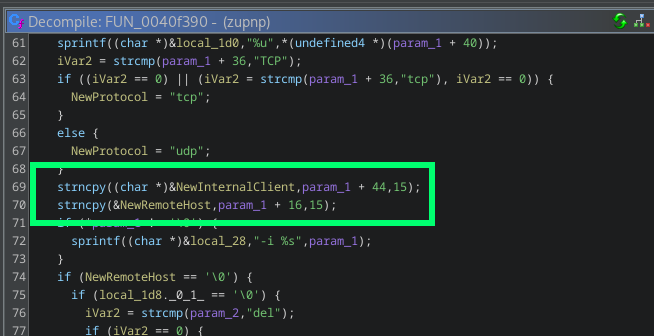
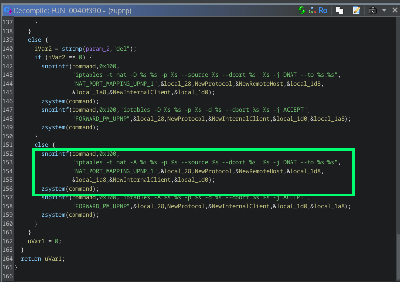
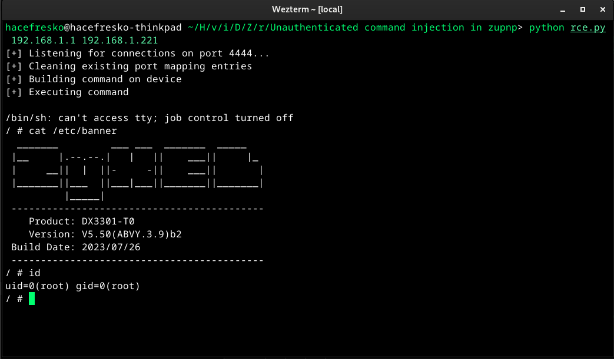

# CVE-2025-13942

The `zupnp` binary, which implements UPnP Internet Gateway Device (IGD) services on several zyxel routers, contains an unauthenticated command injection vulnerability on TCP port 38400.

## Description

The `zupnp` binary exposes a UPnP control service on TCP port 38400 that implements standard `WANIPConnection` and `WANPPPConnection` SOAP actions. These services allow clients on the local network to dynamically manage NAT port forwarding rules via actions such as `AddPortMapping` and `DeletePortMapping`. When a client submits an `AddPortMapping` request, the SOAP handler eventually invokes function `zupnpPortMappingExecute`, which processes the supplied parameters and programs the corresponding NAT rule in the system firewall.

The vulnerability is located in the function at address `0x0040f390`, which is called by `zupnpPortMappingExecute` when handling the `AddPortMapping` action. This function extracts user-controlled parameters from the parsed SOAP request, including `NewRemoteHost`, `NewInternalClient`, `NewExternalPort` and `NewProtocol`, and uses them to construct an `iptables` command that installs a DNAT rule.

The relevant parameters are copied using `strncpy` into local buffers with fixed length limits (15 bytes for `NewRemoteHost` and `NewInternalClient`, and 3 bytes for `NewProtocol`). However, no validation is performed to ensure that the supplied values conform to expected formats (e.g., IPv4 addresses or protocol identifiers):

After copying, these values are inserted directly into an `iptables` command string using `snprintf`. The constructed command string is then executed via `zsystem`, which is a thin wrapper around the standard `system` call:

Because `NewRemoteHost` is placed directly after the `--source` option and `NewInternalClient` is embedded in the `--to` argument, an attacker can inject shell control characters such as `;`, backticks or command substitution syntax. Even though the parameters are length-limited, the absence of character validation allows short but syntactically valid shell fragments to break out of the intended `iptables` command and append arbitrary commands.

## Exploitation

To exploit this command injection with the 15 character limitation, the malicious command must be built on the device into a temporal script, which is then executed. To do so, both `NewRemoteHost` and `NewInternalClient` are used. Since each parameter allows only 15 characters, the exploit leverages the fact that both fields are inserted into the same `iptables` command at different positions. The `NewRemoteHost` parameter appears in the `--source` argument, while `NewInternalClient` appears in the `--to` argument of the DNAT rule.

The exploitation technique works by using `NewRemoteHost` to define a shell variable pointing to the temporary script file (`;a=/tmp/a;`), and `NewInternalClient` to append content to that file (`;printf X>>$a;`). When the `iptables` command is executed via `zsystem`, both injected shell commands run in sequence. The semicolons terminate the intended iptables arguments and allow arbitrary command chaining. By sending multiple `AddPortMapping` requests, the exploit builds the target command character-by-character in `/tmp/a`. Each request appends a single character using `printf`, and once the complete reverse shell command is assembled, a final request executes the script with `;sh /tmp/a;`.

The attacker sends these UPnP SOAP requests to port 38400 without any authentication. The complete exploitation process requires one request per character in the payload command, plus additional requests to initialize the temporary file and execute it.

If a port mapping entry already exists for a given port, the `AddPortMapping` command fails. Because of it, all port mapping entries that will be used to build and execute the command are cleared before hand.

## Affected models

| Product Category | Model        | Affected Firmware Version     |
| ---------------- | ------------ | ----------------------------- |
| DSL/Ethernet CPE | DM4200-B0    | 5.17(ACBS.1.5)C0 and earlier  |
| DSL/Ethernet CPE | DX3300-T0    | 5.50(ABVY.7)C0 and earlier    |
| DSL/Ethernet CPE | DX3300-T1    | 5.50(ABVY.7)C0 and earlier    |
| DSL/Ethernet CPE | DX3301-T0    | 5.50(ABVY.7)C0 and earlier    |
| DSL/Ethernet CPE | DX4510-B0    | 5.17(ABYL.10)C0 and earlier   |
| DSL/Ethernet CPE | DX4510-B1    | 5.17(ABYL.10)C0 and earlier   |
| DSL/Ethernet CPE | DX5401-B1    | 5.17(ABYO.7)C0 and earlier    |
| DSL/Ethernet CPE | EE3301-00    | 5.63(ACMU.2)C0 and earlier    |
| DSL/Ethernet CPE | EE5301-00    | 5.63(ACLD.2)C0 and earlier    |
| DSL/Ethernet CPE | EE6510-10    | 5.19(ACJQ.4)C0 and earlier    |
| DSL/Ethernet CPE | EMG3525-T50B | 5.50(ABPM.9.6)C0 and earlier  |
| DSL/Ethernet CPE | EMG5523-T50B | 5.50(ABPM.9.6)C0 and earlier  |
| DSL/Ethernet CPE | EMG6726-B10A | 5.13(ABNP.8.1)C1 and earlier  |
| DSL/Ethernet CPE | EX2210-T0    | 5.50(ACDI.2.3)C0 and earlier  |
| DSL/Ethernet CPE | EX3300-T0    | 5.50(ABVY.7)C0 and earlier    |
| DSL/Ethernet CPE | EX3300-T1    | 5.50(ABVY.7)C0 and earlier    |
| DSL/Ethernet CPE | EX3301-T0    | 5.50(ABVY.7)C0 and earlier    |
| DSL/Ethernet CPE | EX3500-T0    | 5.44(ACHR.5)C0 and earlier    |
| DSL/Ethernet CPE | EX3501-T0    | 5.44(ACHR.5)C0 and earlier    |
| DSL/Ethernet CPE | EX3510-B0    | 5.17(ABUP.15.1)C0 and earlier |
| DSL/Ethernet CPE | EX3510-B1    | 5.17(ABUP.15.1)C0 and earlier |
| DSL/Ethernet CPE | EX3600-T0    | 5.70(ACIF.2)C0 and earlier    |
| DSL/Ethernet CPE | EX5401-B1    | 5.17(ABYO.7)C0 and earlier    |
| DSL/Ethernet CPE | EX5510-B0    | 5.17(ABQX.11)C0 and earlier   |
| DSL/Ethernet CPE | EX5512-T0    | 5.70(ACEG.5.3)C0 and earlier  |

## References

- [Official advisory](https://www.zyxel.com/global/en/support/security-advisories/zyxel-security-advisory-for-null-pointer-dereference-and-command-injection-vulnerabilities-in-certain-4g-lte-5g-nr-cpe-dsl-ethernet-cpe-fiber-onts-security-routers-and-wireless-extenders-02-24-2026)