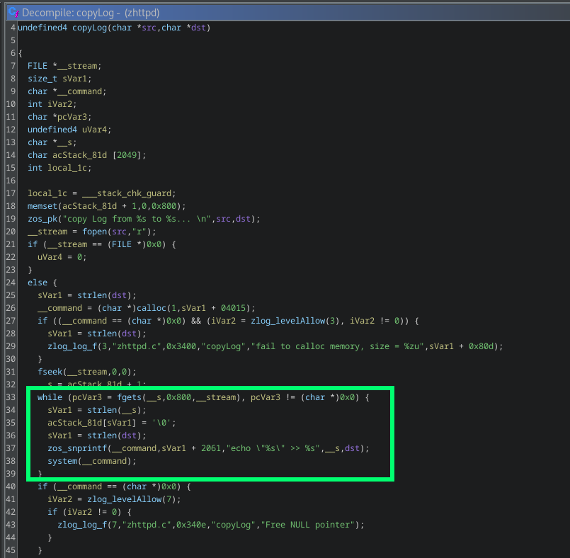
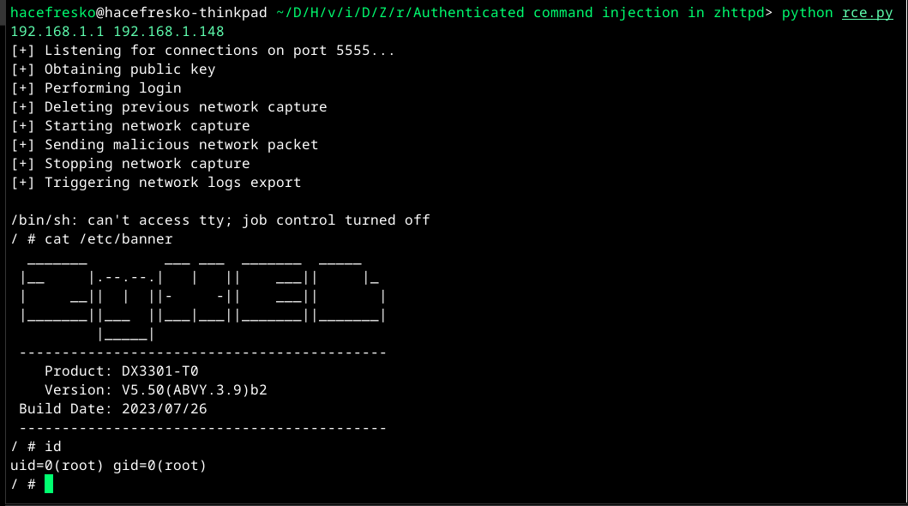

# CVE-2025-13943

The `zhttpd` binary, which serves as the HTTP/HTTPS web server on multiple Zyxel routers, contains an authenticated command injection vulnerability in the log file download function.

## Description

The HTTP/HTTPS server exposed by `zhttpd` contains `/cgi-bin/LogResult` endpoint, which is handled by function `zHttpLogHandle`, and is responsible for managing device log operations. It supports multiple actions such as starting and stopping packet captures (`START_CAPTUR`, `STOP_CAPTUR`), deleting logs (`DEL_LOG`), retrieving logs (`GET_LOG`), exporting logs (`EXPORT_LOG`)... These actions are triggered by authenticated requests and operate on different log categories identified by parameters such as `oid`, `sid`, and `iid`. In the case of a packet capture (`sid=packetcapture`), the endpoint controls the lifecycle of a `tcpdump` capture process and later prepares the captured output for download when an export is requested.

The vulnerability is located in the `copyLog` function at address `0x0002112c`, which is invoked when handling the `EXPORT_LOG` action for packet capture logs. During export, `zHttpLogHandle` calls `copyLog` to read the previously generated `tcpdump` capture file and write its contents into a new log file that is returned to the client as a downloadable artifact.

Inside `copyLog`, the source capture file is opened and processed line by line using `fgets` with a buffer size of `0x800` bytes. For each line read, the function constructs a shell command using `zos_snprintf` with the format string. The first `%s` is replaced directly with the captured log line, and the second with the destination file path. The constructed command string is then passed to `system` for execution. No escaping or sanitization is applied to the captured content before it is embedded into the shell command:

When the `tcpdump` capture contains something like an HTTP request with shell metacharacters in headers, these are written directly into the log file and later executed.

## Exploitation

1. Authenticate to the web interface with valid credentials to obtain a session key.
2. Start the packet capture by sending a GET request to `/cgi-bin/LogResult?action=START_CAPTUR&oid=RDM_OID_LOG_CLASSIFY&sid=packetcapture&iid=[1,0,0,0,0,0]`, which initiates tcpdump.
3. Inject the malicious payload by sending an HTTP request with a header containing the payload. 
4. Stop the packet capture by sending a GET request to `/cgi-bin/LogResult?action=STOP_CAPTUR&oid=RDM_OID_LOG_CLASSIFY&sid=packetcapture&iid=[1,0,0,0,0,0]`.
5. Trigger the vulnerability by sending a POST request to `/cgi-bin/LogResult?action=EXPORT_LOG&oid=RDM_OID_LOG_CLASSIFY&iid=[1,0,0,0,0,0]`.

The `EXPORT_LOG` action triggers `zHttpLogHandle` at address `0x00052eec` and `0x00052fb4`, which calls `copyLog`. When processing the captured packet containing the injected command, the shell command is executed with root privileges:

>Due to log file handling issues, after one successful exploit execution, subsequent attempts may fail until some time has passed. This is likely related to log files not being saved correctly or the zhttpd process crashing. It can probably be fixed easily.

## Affected models

| Product Category          | Model               | Affected Firmware Version                                      |
| ------------------------- | ------------------- | -------------------------------------------------------------- |
| 4G LTE/5G NR CPE          | LTE3301-PLUS        | 1.00(ABQU.8)C0 and earlier                                     |
| 4G LTE/5G NR CPE          | NR7101              | 1.00(ABUV.11)C0 and earlier                                    |
| 4G LTE/5G NR CPE (Nebula) | Nebula LTE3301-PLUS | 1.18(ACCA.6)C0 and earlier                                     |
| 4G LTE/5G NR CPE (Nebula) | Nebula NR7101       | 1.16(ACCC.1)C0 and earlier                                     |
| DSL/Ethernet CPE          | DX4510-B0           | 5.17(ABYL.10)C0 and earlier                                    |
| DSL/Ethernet CPE          | DX4510-B1           | 5.17(ABYL.10)C0 and earlier                                    |
| DSL/Ethernet CPE          | EE6510-10           | 5.19(ACJQ.4)C0 and earlier                                     |
| DSL/Ethernet CPE          | EMG6726-B10A        | 5.13(ABNP.8.1)C1 and earlier                                   |
| DSL/Ethernet CPE          | EX2210-T0           | 5.50(ACDI.2.3)C0 and earlier                                   |
| DSL/Ethernet CPE          | EX3510-B0           | 5.17(ABUP.15.1)C0 and earlier                                  |
| DSL/Ethernet CPE          | EX3510-B1           | 5.17(ABUP.15.1)C0 and earlier                                  |
| DSL/Ethernet CPE          | EX5510-B0           | 5.17(ABQX.11)C0 and earlier                                    |
| DSL/Ethernet CPE          | EX5512-T0           | 5.70(ACEG.5.3)C0 and earlier                                   |
| DSL/Ethernet CPE          | EX7710-B0           | 5.18(ACAK.1.5)C0 and earlier                                   |
| DSL/Ethernet CPE          | VMG4927-B50A        | 5.13(ABLY.10.1)C0 and earlier                                  |
| Fiber ONTs                | PX3321-T1           | 5.44(ACJB.1.4)C0 / 5.44(ACHK.2)C0 / 5.44(ACHK.3)C0 and earlier |
| Fiber ONTs                | PX5301-T0           | 5.44(ACKB.0.5)C0 and earlier                                   |
| Wireless Extenders        | WX5610-B0           | 5.18(ACGJ.0.4)C0 and earlier                                   |

## References

- [Official advisory](https://www.zyxel.com/global/en/support/security-advisories/zyxel-security-advisory-for-null-pointer-dereference-and-command-injection-vulnerabilities-in-certain-4g-lte-5g-nr-cpe-dsl-ethernet-cpe-fiber-onts-security-routers-and-wireless-extenders-02-24-2026)