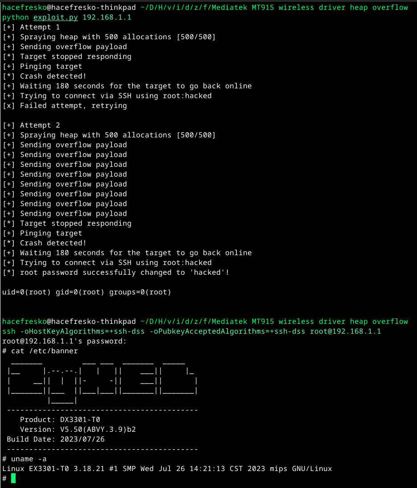

# CVE-2026-20452

>The exploit presented in this repository was written for the Zyxel EX3301-T0 (firmware V5.50(ABVY.3.9)b2_G0), which uses the Mediatek MT7915 chipset. Since it uses fixed memory addresses kernel functions and data structs, this exploit will probably only work for this model and firmware version.

## Root cause

A heap-based buffer overflow exists in the MediaTek kernel wireless driver's WPS handling logic, specifically in the function `WscSelectedRegistrar`.

This function processes `SetSelectedRegistrar` UPnP messages, which are defined by the Wi-Fi Protected Setup (WPS) specification as part of the `WFAWLANConfig` service. This action allows an external registrar to send configuration data to an access point, including attributes encoded as TLVs (Type-Length-Value structures) within a base64-encoded message.

The vulnerability occurs during parsing of TLV type `0x1049`. The relevant logic is:

```c
void WscSelectedRegistrar(int param_1, void *buf_ptr, uint buf_len, uint param_4) {
    // ...
    while( true ) {
        memmove(&tlv_type, buf_ptr, 2);
        memmove(&tlv_len, buf_ptr + 2, 2);

        if (buf_len < tlv_len + 4) {
            // error
        }
        buf_ptr = buf_ptr + 4;

        if (tlv_type != 0x1049) break;

        if (sub_item == 0x0) {
            os_alloc_mem(0, &sub_item, tlv_len);  // kmalloc wrapper

            if (sub_item == 0x0) {
                // error
            }
        }
        memset(sub_item, 0, tlv_len);

        // extracts and copies sub-item from buf_ptr into sub_item
        WscParseV2SubItem(1, buf_ptr, tlv_len, sub_item, sub_item_len);
      
        buf_len = (buf_len - tlv_len) - 4;
        buf_ptr = buf_ptr + tlv_len;

        if (buf_len < 5) break;
    }
    // ...
}
```

The buffer `sub_item` is allocated only once, based on the length of the first `0x1049` TLV. For subsequent TLVs of the same type, the allocation is skipped, but the new `tlv_len` is still used in both `memset` and `WscParseV2SubItem`.

If a later TLV has a larger length than the first, this results in an out-of-bounds write, causing a heap buffer overflow and allowing attacker-controlled data to corrupt adjacent kernel memory.

The root cause is improper handling of repeated variable-length TLVs, where buffer allocation is based on the first instance but reused across subsequent instances without bounds checking or reallocation.

### Exposure in tested device

On the Zyxel EX3301-T0, this vulnerable driver path is reachable via the `wscd` daemon, which exposes the WPS `WFAWLANConfig` service over UPnP.

The `wscd` service accepts unauthenticated `SetSelectedRegistrar` SOAP requests, decodes the TLV payload from the `NewMessage` parameter, and forwards it directly to the kernel using a private Wireless Extensions `ioctl` (`0x8BE1`). This allows attacker-controlled network input to reach `WscSelectedRegistrar` in kernel space.

## Exploitation

For more information about this vulnerability, check [this blog post](https://hacefresko.com/posts/rce-on-isp-router-and-mediatek-0day), in which I cover in detail the finding of the bug and the exploitation process on my testing device, which was the Zyxel EX3301-T0, firmware version V5.50(ABVY.3.9)b2_G0, using the Mediatek MT7915 chip.

As a summary of the exploitation process, here is a very cool diagram of what happens on a successful exploitation attempt:


And here is the remote exploit in action:



## Affected devices

As stated in the official advisory, these are the affected devices (this list may not be complete):

- MT6890
- MT7615
- MT7915
- MT7916
- MT7981
- MT7986
- MT7990
- MT7992
- MT7993

## References

- [Official advisory](https://corp.mediatek.com/product-security-bulletin/June-2026)