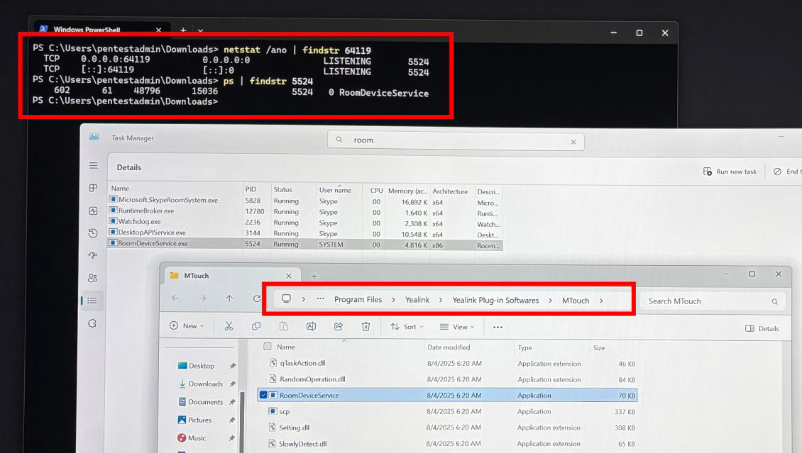
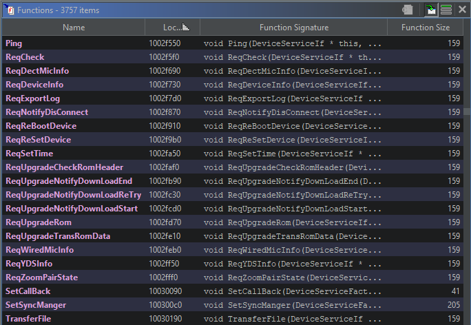
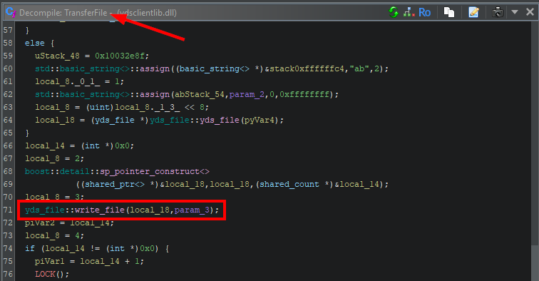
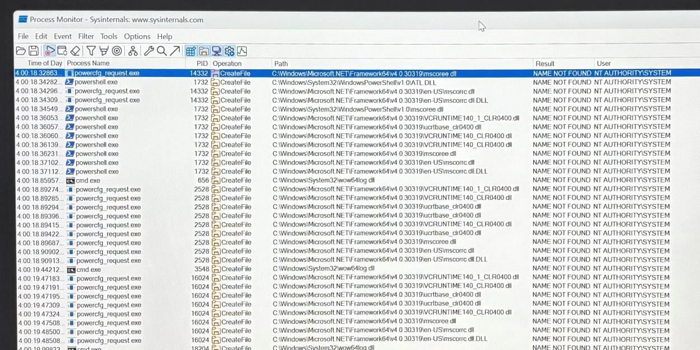
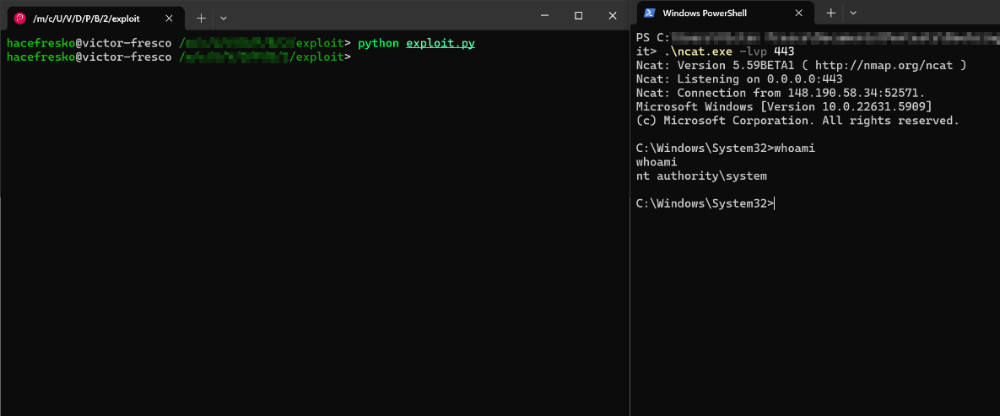

This was a vulnerability found last year by Ricardo Pelaz Garcia ([@varandinawer](https://x.com/Varandinawer)) and I during an engagement. Although it was fixed many months ago and there is already a public advisory, no CVE has been published. I have now decided to upload the exploit since Yealink already told us that all client devices are fixed, so who cares.

Btw, this is the official advisory: [Yealink Plug-in Softwares Remote Code Execution Vulnerability](https://www.yealink.com/en/trust-center/security-bulletins/yealink-plugin-softwares-remote-code-execution-vulnerability)

The report below is mostly the same that we sent to Yealink. 

# Yealink Meetingboard Pro Unauthenticated Arbitrary File Write to RCE

The Yealink Meetingboard Pro, on its Windows configuration, is vulnerable to an unauthenticated Arbitrary File Write, which can easily be escalated to an unauthenticated Remote Code Execution. This vulnerability is exploitable remotely over the network without any authentication.

## Description

The executable `RoomDeviceService.exe`, located at `C:\Program Files\Yealink\Yealink Plug-in Softwares\MTouch\`, listens by default on TCP port 64119:

A reverse engineering effort of the executable and the associated libraries revealed that this process accepts data using the Apache Thrift protocol, which enables binary, compact and cross-language communications to execute remote procedure calls (RPC) on the device. It was found that the library `ydsclientlib.dll`, located at `C:\Program Files\Yealink\Yealink Plug-in Softwares\MTouch\`, is the one in charge of handling incoming data and processing each available function call. Below is a list of some of these available calls:

Besides, no authentication or authorization mechanism was found, allowing any user with network access to the device to invoke any of these function calls.

One of the available function calls, `TransferFile()`, is used to upload files to the device. The following image shows a call to function `yds_file::write_file()` from `TransferFile()`:

By further analysing the expected packet structure for this Apache Thrift protocol, it was possible to create a PoC that used the `TransferFile()` function call to upload and write an arbitrary file anywhere in the file system, since the process runs as `SYSTEM`.

Once the Arbitrary File Write primitive was confirmed, it was escalated to RCE by using DLL hijacking. In this case, the DLL `C:\Windows\Microsoft.NET\Framework64\v4.0.30319\mscoree.dll` was used, although this might change in other firmware versions. The following image shows that this DLL is being loaded without success by a `SYSTEM` process:

A very simple [C++ program](./rev_shell.c) was created to generate a malicious DLL that would open a reverse shell. It is slightly obfuscated to bypass Windows Defender at the time of writing this report. It can be used along the provided [python script](./exploit.py) to achieve RCE:

